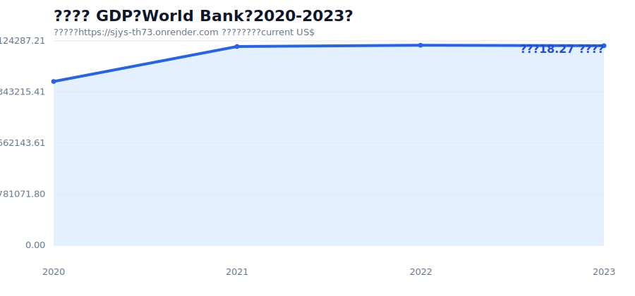
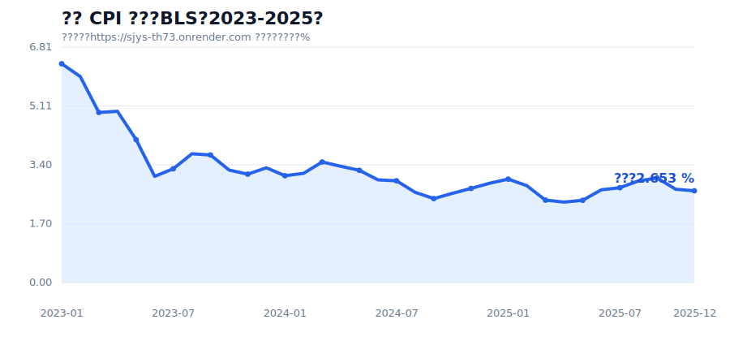
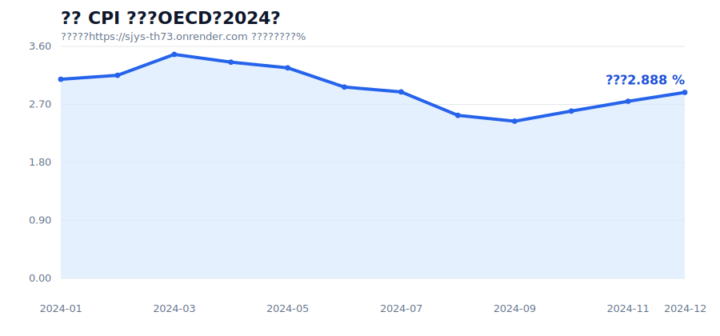
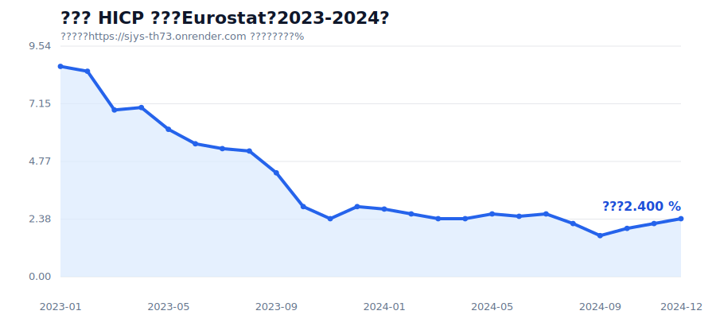
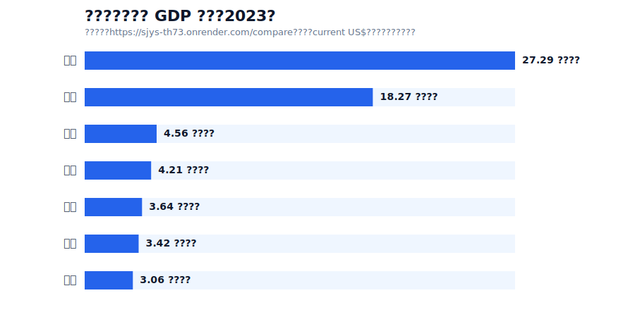

# 报告正文补充稿：基于真实线上数据的系统可用性与应用价值

## 一、系统建设目标

经观 EconView 面向全球宏观经济指标采集、标准化、质量治理和可视化展示。系统不是静态数据看板，而是通过统一接口实时访问 World Bank、BLS、Eurostat、IMF、OECD、ECB、BIS 等官方公开数据源，将不同格式的原始数据转换为一致的 JSON 结构，并在网页端展示趋势图、元数据、质量报告和可复核的原始 JSON。

截至本次线上验证，系统 `/capabilities` 与 `/consistency` 接口显示：已接入 7 个官方数据源、18 个标准指标、8 个国家或地区，提供 33 条示例查询；一致性校验 5 项全部通过，18 个指标均具备完整元数据和来源映射。

## 二、真实数据展示结果

本节使用 `https://sjys-th73.onrender.com/` 线上接口返回的真实数据，不使用模拟数据集。

### 1. 中国名义 GDP

调用 `/series?country=CN&indicator_code=GDP_NOMINAL&start_date=2020&end_date=2023&frequency=A`，系统返回 World Bank 数据 4 条，质量校验通过。2023 年中国名义 GDP 为 18.27 万亿美元。该案例适合展示年度宏观指标接入、单位标准化和来源追溯。

### 2. 美国 CPI 同比（BLS）

调用 `/series?country=US&indicator_code=CPI_YOY&start_date=2023-01&end_date=2025-12&frequency=M`，系统返回 BLS 月度数据 35 条，质量校验通过。最新观测为 2025-12，数值为 2.6533%。该指标由 CPI 指数派生得到，观测值中保留了同比计算方法和上一年同月基准期。

### 3. 美国 CPI 同比（OECD）

调用 `/series?country=US&indicator_code=OECD_CPI_YOY&start_date=2024-01&end_date=2024-12&frequency=M`，系统返回 OECD 数据 12 条，质量校验通过。2024-12 的美国 CPI 同比为 2.8881%。该案例适合说明系统可以对同一经济主题接入不同官方来源，并为跨源复核提供基础。

### 4. 欧元区 HICP 同比

调用 `/series?country=EA&indicator_code=HICP_YOY&start_date=2023-01&end_date=2024-12&frequency=M`，系统返回 Eurostat 数据 24 条，质量校验通过。最新观测为 2024-12，数值为 2.4%。该案例展示了欧洲统计数据源的月度通胀指标接入能力。

### 5. 多国 GDP 横向对比

调用 `/compare?countries=US,CN,DE,JP,GB,IN,FR&indicator_code=GDP_NOMINAL&date=2023&frequency=A`，系统返回 7 个国家的 2023 年名义 GDP。结果显示，美国为 27.29 万亿美元，中国为 18.27 万亿美元，德国为 4.56 万亿美元，日本为 4.21 万亿美元，印度为 3.64 万亿美元，英国为 3.42 万亿美元，法国为 3.06 万亿美元。该案例证明系统不仅能查单一时间序列，也能支持多国家同指标横向比较。

## 三、网页可用性体现

网页端将“数据查询、图表展示、元数据说明、质量报告、JSON 输出”整合在同一个工作流中。用户输入国家、指标、日期和频率后，系统自动完成参数校验、数据源选择、官方接口请求、数据标准化、质量检查和图表绘制。查询成功时，页面展示趋势图、最新值、来源机构、数据集、源序列编码、更新时间和完整观测表；查询失败时，页面返回结构化错误码和原因，区分参数错误、上游接口失败和数据格式异常。

这类设计比单纯展示静态图片更实用：一方面，评审和用户可以现场修改时间范围或指标，验证数据不是预置截图；另一方面，JSON 输出可以直接被研究脚本、可视化工具或 AI Agent 复用。

## 四、网页实用性体现

从实际应用角度看，系统可以服务三类场景。

第一，宏观研究人员可以用它快速获取 GDP、CPI、利率、汇率等指标，并通过统一结构减少清洗成本。第二，课程、竞赛或答辩场景可以用真实接口返回证明系统已经接通多源官方数据，而不是模拟数据。第三，自动化系统可以通过 `/capabilities`、`/schema`、`/series` 和 `/compare` 进行机器可读调用，把网页能力扩展为数据服务能力。

## 五、建议展示方式

正式汇报时建议按以下顺序展示：

1. 首页展示：说明系统已接入 7 个官方数据源、18 个标准指标、33 条示例查询。
2. 单指标年度数据：展示中国名义 GDP，强调 World Bank 接入和年度指标标准化。
3. 高频月度数据：展示美国 CPI 同比，强调 BLS 月度数据、派生计算和质量报告。
4. 跨源复核：展示 OECD 美国 CPI 同比，说明同类主题可以从不同官方来源获取。
5. 跨国比较：展示 2023 年主要经济体 GDP 横向对比，强调 `/compare` 的实用性。
6. 机器可读能力：展示 JSON 输出、`/schema` 和 `/capabilities`，说明系统可服务网页、脚本和 Agent。

以上展示均基于线上接口真实返回，图表和数字可由 `docs/real_data_evidence/raw_online_responses.json` 复核。

